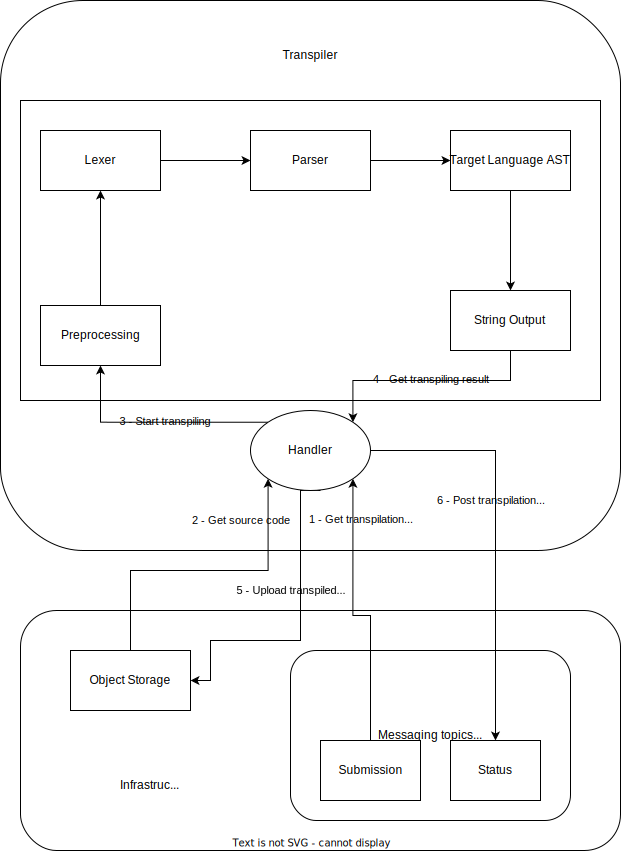

# Tereus C to Go transpiler

Tereus transpilers mostly works like a compiler but instead of generating machine code, it generates text.

We use ANLTR to parse the source code into a AST (Abstract Syntax Tree).

> ANTLR (ANother Tool for Language Recognition) is a powerful parser generator for reading, processing, executing, or translating structured text or binary files.
>
> https://github.com/antlr/antlr4

## Architecture



## Command-line usage

You can use the following command to convert a C file to Go:

```shell
go run cmd/cli/main.go <input.c>
```

## Worker usage

The transpiler is designed to listen on a queue for C files to convert.

First, you need to copy the `.env.example` file to `.env` and fill in the values.

The Kafka endpoint and S3 bucket should be shared with the [Tereus API](https://github.com/tereus-project/tereus-api).

You can then start the worker with:

```shell
➜  go run .
INFO[0000] Connecting to Kafka...
INFO[0000] Connecting to MinIO...
INFO[0000] Starting transpiler job listener...
DEBU[0006] Job '48549e3e-a181-49f5-b204-0fc56df3e319' started
DEBU[0006] Downloading job files...
DEBU[0006] Downloading file 'main.c'
DEBU[0006] Remixing file 'main.c'
DEBU[0006] Uploading file 'main.go'
DEBU[0007] Job '48549e3e-a181-49f5-b204-0fc56df3e319' completed
```

The worker will get transpilation submissions from a queue and update the status and result in another one.

## Supported features

- Variables
  - [x] Declaration
    - [x] Global variables
  - [x] Initialization
  - [x] Assignment
  - [x] Automatic type conversion
  - [x] Variable list
  - [x] Array variables declaration
    - [x] Sized
    - [ ] Unsized
  - [x] Multiple inline variables declaration
    - [x] With pointers
- Functions
  - [ ] Declaration with no definition
  - [x] Declaration with definition
  - [x] Arguments
  - [x] Recursion
- Types
  - [x] Pointers
  - [x] Arrays
    - [x] Multi-dimensional arrays
  - Structures
    - [x] Declaration with no definition
    - [x] Declaration with definition
    - [x] Initialization
  - [ ] Unions
  - [x] Enums
  - [x] Typedefs
- Statements
  - [x] `if`
  - [x] `for`
    - [ ] With empty body
    - [ ] With multiple increments
  - [x] `do`
  - [x] `while`
  - [x] `switch`
  - [x] `case`
  - [x] `default`
  - [x] `break`
  - [x] `continue`
  - [x] `return`
  - [x] `goto`
- Expressions
  - [x] Array indexing
  - [x] List initialization
  - [x] Structure property access
  - [x] Pointer property access
  - [x] Function call
  - [x] Type casting
- Arithmetic
  - [x] Addition (+)
  - [x] Subtraction (-)
  - [x] Multiplication (\*)
  - [x] Division (/)
  - [x] Modulo (%)
  - [x] Prefix increment (++)
  - [x] Prefix decrement (--)
  - [x] Postfix increment (++)
  - [x] Postfix decrement (--)
- Bitwise operations
  - [x] Bitwise AND (&)
  - [x] Bitwise OR (|)
  - [x] Bitwise XOR (^)
  - [x] Bitwise NOT (~)
  - [x] Bitwise Left Shift (<<)
  - [x] Bitwise Right Shift (>>)
- Logical operations
  - [x] Logical AND (&&)
  - [x] Logical OR (||)
  - [x] Logical NOT (!)
- Conditional operations
  - [x] Equality (==)
  - [x] Inequality (!=)
  - [x] Less than (<)
  - [x] Less than or equal to (<=)
  - [x] Greater than (>)
  - [x] Greater than or equal to (>=)
- Assignment operations
  - [x] Basic assignment (=)
  - [x] Addition assignment (+=)
  - [x] Subtraction assignment (-=)
  - [x] Multiplication assignment (\*=)
  - [x] Division assignment (/=)
  - [x] Modulo assignment (%=)
  - [x] Bitwise AND assignment (&=)
  - [x] Bitwise OR assignment (|=)
  - [x] Bitwise XOR assignment (^=)
  - [x] Bitwise Left Shift assignment (<<=)
  - [x] Bitwise Right Shift assignment (>>=)
  - [x] Ternary operator (?:)
- Pointers operations
  - [x] Pointer dereference (\*)
  - [x] Pointer addition (+)
  - [x] Pointer subtraction (-)
  - [x] Prefix pointer increment (++)
  - [x] Prefix pointer decrement (--)
  - [x] Postfix pointer increment (++)
  - [x] Postfix pointer decrement (--)
  - [x] Value address (&)
- Misc
  - [x] Comments
    - [x] Single-line comments
    - [x] Multi-line comments
  - [x] `sizeof`
- Preprocessor directives
  - [x] `#define A B`
  - [x] `#define F(x) x`
  - [ ] `#define F(x) x ## 1`
  - [ ] `#undef A`
  - [ ] `#if A`
  - [ ] `#ifdef A`
  - [ ] `#ifndef A`
  - [ ] `#else`
  - [ ] `#elif A`
  - [ ] `#endif`
  - [ ] `#include <stdlib.h>`
  - [ ] `#include "./locallib.h"`
- Standard Library
  - `stdlib.h`
    - [ ] `atof`
    - [ ] `atoi`
    - [ ] `atol`
    - [ ] `strtod`
    - [ ] `strtol`
    - [ ] `strtoul`
    - [ ] `calloc`
    - [x] `free`
    - [x] `malloc`
    - [ ] `realloc`
    - [ ] `abort`
    - [ ] `atexit`
    - [ ] `exit`
    - [ ] `getenv`
    - [ ] `system`
    - [ ] `bsearch`
    - [ ] `qsort`
    - [ ] `abs`
    - [ ] `div`
    - [ ] `labs`
    - [ ] `ldiv`
    - [ ] `rand`
    - [ ] `srand`
    - [ ] `mblen`
    - [ ] `mbstowcs`
    - [ ] `mbtowc`
    - [ ] `wcstombs`
    - [ ] `wctomb`
  - `assert.h`
    - [x] `assert`
  - `string.h`
    - [x] `memset`
    - [x] `memchr`
    - [x] `memcmp`
    - [x] `memcpy`
    - [x] `memmove`
    - [x] `strcat`
    - [x] `strncat`
    - [x] `strchr`
    - [x] `strcmp`
    - [x] `strncmp`
    - [x] `strcoll`
    - [x] `strncpy`
    - [x] `strcspn`
    - [ ] `strerror`
    - [x] `strlen`
    - [x] `strpbrk`
    - [x] `strrchr`
    - [x] `strspn`
    - [ ] `strtok`
    - [ ] `strxfrm`
